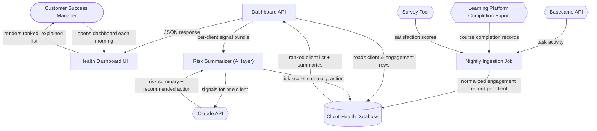
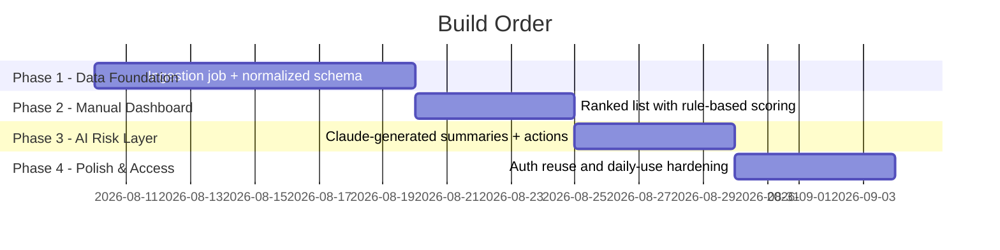

# Client Health Signal Dashboard — Architecture

## The Idea

Colaberry runs a cohort-based Enterprise AI Leadership Accelerator for corporate clients, and today client health is tracked by memory and scattered spreadsheets pulled from Basecamp tasks, course-completion exports, and post-session surveys. This project is a **Client Health Signal Dashboard** for Colaberry's customer success team: every night it pulls engagement data from the Basecamp API (task activity), the learning platform's completion export (course progress), and the survey tool (satisfaction scores) into one place, an AI layer reads each client's combined signal and writes a one-paragraph risk summary plus a recommended next action, and a customer success manager logs in each morning to see every active client ranked by urgency.

**The one thing it must do well on day one:** within a single login, correctly surface which of the roughly 30 active enterprise clients need a check-in this week, and why. Everything else can be rough at first.

## Components

| Component | What it does (plain English) | Words in the paragraph that required it |
|---|---|---|
| Health Dashboard UI (frontend) | The screen a customer success manager opens each morning to see every client ranked by how urgently they need attention. | "a customer success manager logs in each morning to see every active client ranked by urgency" |
| Dashboard API (backend) | The traffic controller that gathers everything the dashboard needs to show — client rankings, summaries, recommended actions — and hands it to the screen. | Implied by "logs in... to see" — a human interface needs something serving it assembled data |
| Client Health Database | The filing cabinet that remembers every client's engagement history and latest risk summary between visits, so the picture doesn't reset every time someone logs in. | "every night it pulls... into one place" and "ranked by urgency" — the ranking has to still be there the next morning |
| Nightly Ingestion Job (background job) | The overnight worker that goes out, collects the latest activity from all three outside systems, and tidies it into one record per client before anyone logs in. | "every night it pulls engagement data... into one place" |
| Basecamp API (external service) | The outside system that reports how active a client's team has been on their shared task list. | "Basecamp API (task activity)" |
| Learning Platform Completion Export (external service) | The outside system that reports how much of the accelerator coursework a client has actually completed. | "the learning platform's completion export (course progress)" |
| Survey Tool (external service) | The outside system that reports how satisfied a client says they are, from post-session surveys. | "the survey tool (satisfaction scores)" |
| Risk Summarizer (AI layer) | The part that reads a client's combined activity, coursework, and satisfaction signals and writes, in plain language, how worried the team should be and what to do about it. | "an AI layer reads each client's combined signal and writes a one-paragraph risk summary plus a recommended next action" |
| Claude API (LLM provider) | The external AI model the Risk Summarizer actually calls to turn raw signals into that plain-language summary — the "AI layer" needs a model behind it to do the writing. | Implementation of "an AI layer... writes a one-paragraph risk summary" |

No payments, no multi-tenant client-facing login, and no notification/alerting system are included — the paragraph only describes an internal tool for Colaberry's own customer success team, logging in themselves each morning.

## How It Fits Together

## Data Flow

1. At 2:00am, the Nightly Ingestion Job wakes up and calls the Basecamp API for each active client's project, pulling task activity from the last 24 hours.
2. It also pulls the latest course-completion export from the Learning Platform and any new satisfaction scores from the Survey Tool.
3. The job normalizes all three sources into one engagement record per client and writes them to the Client Health Database.
4. Once ingestion finishes, the Dashboard API reads each client's latest engagement bundle from the database.
5. For each client, the Dashboard API sends that signal bundle to the Risk Summarizer, which calls the Claude API with the client's data in the prompt.
6. Claude returns a one-paragraph risk summary and a recommended next action, which the Risk Summarizer writes back to the database against that client.
7. When a Customer Success Manager logs into the Health Dashboard UI in the morning, the frontend calls the Dashboard API.
8. The Dashboard API returns every active client, ranked by risk, along with its summary and recommended action, and the manager can drill into any client to see the raw signals behind the score.

## Build Order

| Phase | Duration | What it proves |
|---|---|---|
| 1 — Data Foundation | 2 weeks | The three outside systems can actually be pulled from and normalized into one schema — proves the hardest unknown (integration access) before anything user-facing exists. |
| 2 — Manual Dashboard | 1 week | A ranked list is useful even with a simple rule-based score (e.g., days since last activity) instead of AI — proves the day-one requirement (surface who needs a check-in, and why) works before adding AI complexity. |
| 3 — AI Risk Layer | 1 week | Claude-generated summaries and recommended actions are more useful than the rule-based score alone — proves the AI layer earns its place rather than being added for its own sake. |
| 4 — Polish & Access | 1 week | The tool is safe and pleasant enough for the whole customer success team to rely on daily (login reuse, error states, refresh visibility). |

## Assumptions

| Assumption | Impact if wrong |
|---|---|
| Basecamp, the learning platform, and the survey tool all expose a queryable API or a reliable export/feed. | If any one is manual/CSV-only, Phase 1 shrinks to a manual-upload step for that source instead of live ingestion. |
| Each enterprise client maps 1:1 to one Basecamp project and one cohort in the learning platform. | If a client spans multiple projects or cohorts, the ingestion job needs a client-mapping table, adding a design layer before Phase 1 can close. |
| Roughly 30 active clients is the near-term ceiling. | At that volume, one Claude call per client per night is cheap and fast enough to run serially; at 10x the volume, the Risk Summarizer would need batching or parallel calls. |
| Customer success managers are the only users on day one — no client-facing login. | Keeps access control simple (reuse existing internal login); if clients ever get their own view, access control becomes a much bigger design piece with per-tenant isolation. |

## What This Design Does Not Cover

- **Authentication/authorization detail** — assumes an existing Colaberry internal login is reused; it does not design a new auth system.
- **Human review of the AI summary** — there is no designed step for a manager to flag or correct a wrong risk summary before it's shown; the AI's output is presented as-is.
- **Historical trending** — the design shows a client's risk as of last night's run only; it does not track or chart how a client's risk has changed over time.
- **Notifications or alerting** — a manager only sees risk changes by opening the dashboard; there is no Slack/email ping when a client crosses a risk threshold.

**The one question that would most change this design:** should the AI's risk summary be shown as a *recommendation to double-check*, or trusted directly as *the* ranking? If it must be double-checked, Phase 2's rule-based score needs to stay on permanently as a visible, independent sanity check next to the AI's — not just as a stepping stone that Phase 3 replaces.
